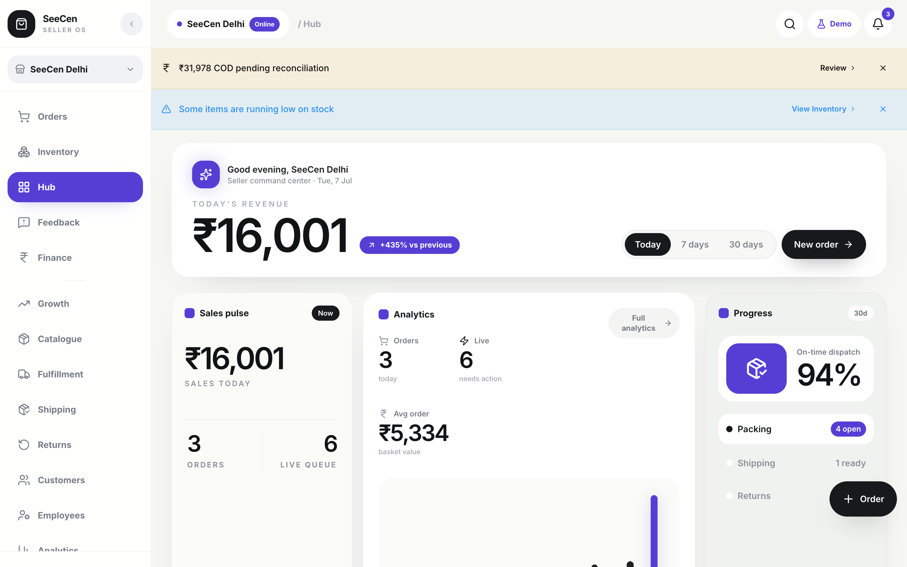

# SeeCen

[](https://github.com/Draven047/SeeCen/actions/workflows/ci.yml)
[](LICENSE)
[](CONTRIBUTING.md)

SeeCen is an open-source seller command center for managing orders, inventory, customers, shipping, returns, finance, analytics, and AI-assisted sales coaching.

The app is designed to be easy to try, fork, and self-host. It runs out of the box with a persistent in-browser demo, so you do not need Supabase, a database, or paid API keys to explore the product. It also installs as a PWA.

**Live demo: https://seecen.seekerscentral.com**

[](https://vercel.com/new/clone?repository-url=https%3A%2F%2Fgithub.com%2FDraven047%2FSeeCen)



## What SeeCen Includes

- Public landing page with product details and open-source download links
- Resettable demo dashboard under `/demo/dashboard`
- Order queue and fulfillment workflow
- Customer management and customer 360 views
- Product catalogue and inventory health
- Shipping, pickup, and tracking screens
- Returns and exchange workflows
- Finance, settlements, COD reconciliation, invoices, and credit notes
- Analytics dashboards for sales and operations
- Local deterministic AI Coach for demo insights
- Bulk order actions, printable pack slips, and GST invoices
- Customer segments (VIP / new / at-risk) with one-tap WhatsApp follow-ups
- ⌘K command palette, keyboard shortcuts, and installable PWA
- Demo data backup/restore (export and import your sandbox as JSON)

## Demo Mode

SeeCen ships demo-first: it runs out of the box with zero setup.

- No Supabase project or `.env` file is required.
- ~90 days of realistic demo data (orders, customers, inventory, returns, settlements) is seeded in the browser on first load, dated relative to today.
- Your changes are saved to localStorage and survive refreshes.
- An untouched sandbox re-seeds itself daily so the data stays current; once you modify anything, your data is kept until you press **Demo → Reset demo data** in the header.
- The AI Coach uses local deterministic insights from the demo data.

Want a real backend? SeeCen also runs against your own Supabase project — see [SELF_HOSTING.md](SELF_HOSTING.md).

## Tech Stack

- Bun
- Vite
- React
- TypeScript
- Tailwind CSS
- shadcn/ui
- Recharts
- Lucide icons

## Download and Run Locally

### Option 1: Clone with Git

```sh
git clone https://github.com/Draven047/SeeCen.git
cd SeeCen
bun install
bun run dev
```

Open the local URL shown in your terminal, usually:

```txt
http://localhost:8080
```

### Option 2: Download ZIP

Download the latest source code:

```txt
https://github.com/Draven047/SeeCen/archive/refs/heads/main.zip
```

Then unzip it and run:

```sh
cd SeeCen-main
bun install
bun run dev
```

## Useful Commands

```sh
bun install
```

Install dependencies.

```sh
bun run dev
```

Start the development server.

```sh
bun run build
```

Create a production build.

```sh
bun run preview
```

Preview the production build locally.

```sh
bun run lint
```

Run lint checks.

## App Routes

Public:

```txt
/
```

Demo:

```txt
/demo/dashboard
/demo/orders
/demo/customers
/demo/inventory
/demo/finance
/demo/shipping
/demo/returns
/demo/analytics
/demo/ai-coach
```

## Run It With Your Own Backend

Set two environment variables and SeeCen switches from the in-browser demo to your own Supabase project (real Postgres, real auth, multi-user):

```txt
VITE_SUPABASE_URL=
VITE_SUPABASE_ANON_KEY=
```

The full walkthrough — creating the project, applying `supabase/migrations`, bootstrapping the first admin, deploying — is in [SELF_HOSTING.md](SELF_HOSTING.md).

## White-labeling

App name, tagline, currency, and locale live in `src/config/brand.ts`. Change them there and the shell and dashboard follow.

## Optional AI Provider Setup

The open-source demo does not call an external AI provider. The AI Coach generates local deterministic recommendations from demo data. To wire your own provider, start from `.env.example` (`AI_PROVIDER_*` values) and the edge functions in `supabase/functions/`.

## Deployment

SeeCen is a Vite single-page app. It can be deployed to Vercel, Netlify, Cloudflare Pages, or any static host.

For Vercel:

```sh
bun run build
```

Build command:

```txt
bun run build
```

Output directory:

```txt
dist
```

The included `vercel.json` rewrites all routes to `index.html`, so direct refreshes like `/demo/orders` work correctly.

## Project Direction

SeeCen is built to become a practical, open-source seller operating system. The current version focuses on a strong free demo and a clean foundation. Future self-hosted versions can add persistent storage, authentication, real marketplace connectors, and bring-your-own-key AI providers.

## License

MIT — see [LICENSE](LICENSE). Fork it, rebrand it, run your store on it.
